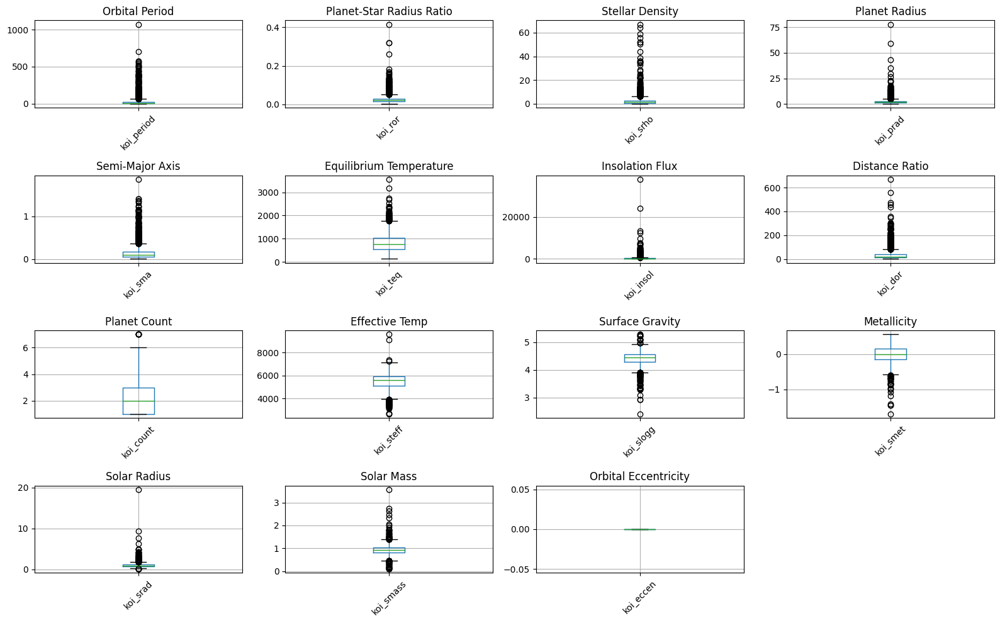
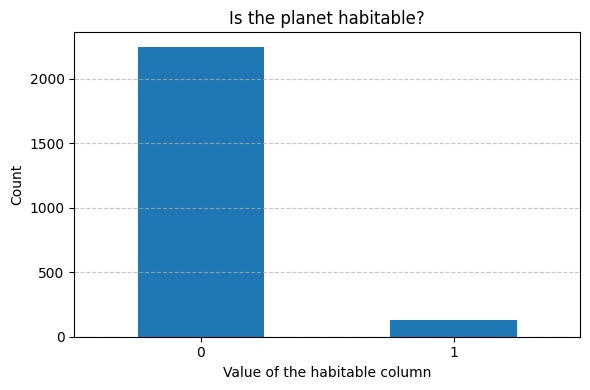
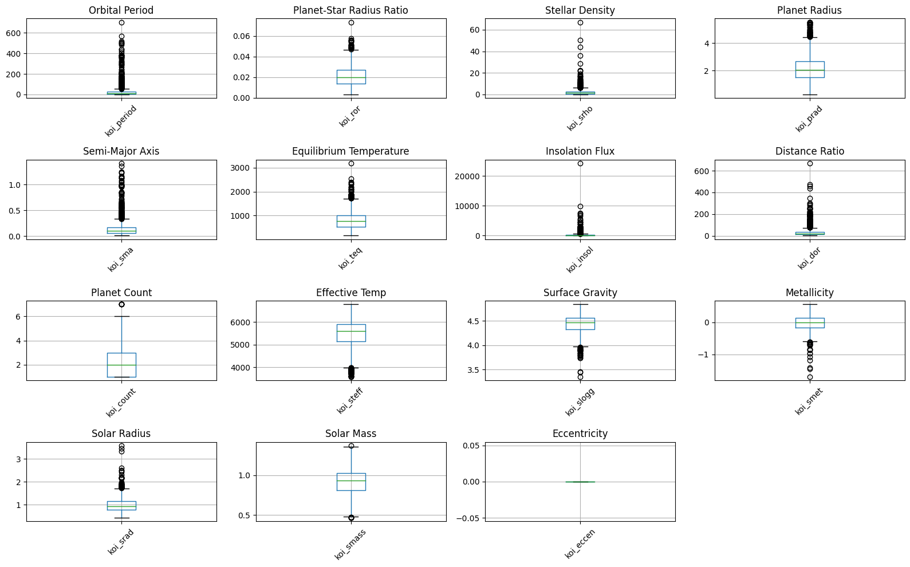
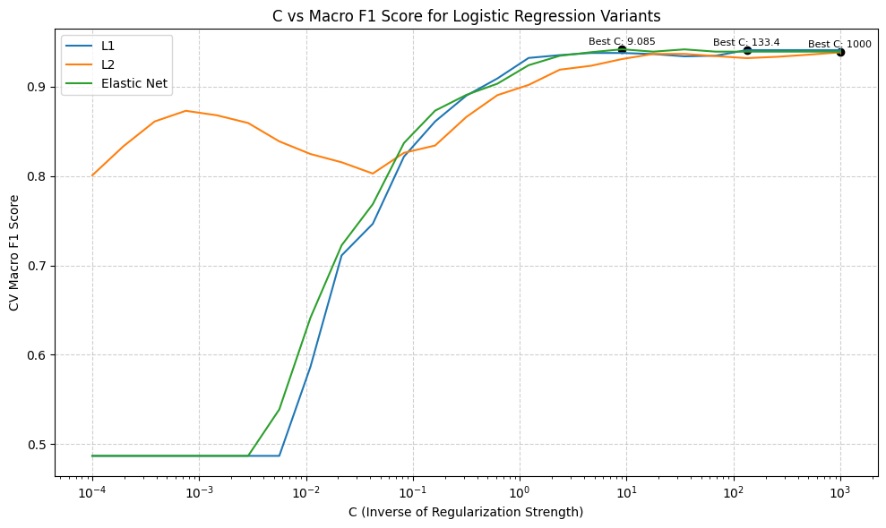
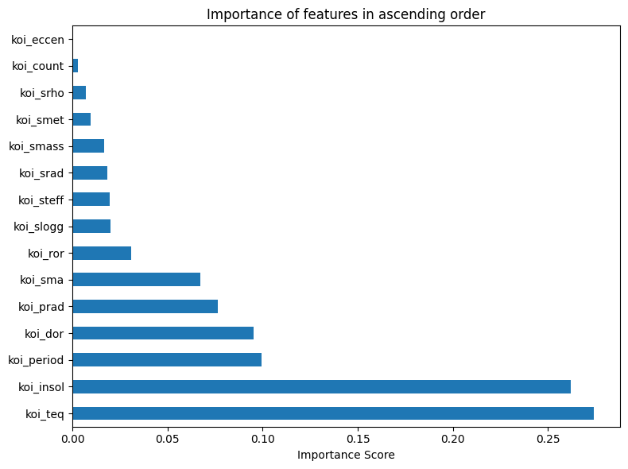
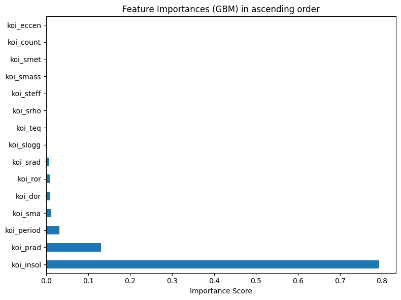

# Current MLSS Exoplanet Classifier Report

## 1. Project overview

This report explains the current state of the MLSS exoplanet classifier notebook. The project is a graduate-level data science / machine learning course project focused on binary classification: predicting whether an exoplanet candidate is labeled habitable or non-habitable.

The current notebook is preserved as a historical course artifact at:

```text
notebooks/mlss-dacss756-final-project-bdave_v10.ipynb
```

The notebook title currently reads "Predicting the Hability of Exoplanets using Machine Learning." The word "Hability" should eventually be corrected to "Habitability," but the notebook has not been edited in this documentation step.

The modeling goal is to learn a relationship between selected Kepler Object of Interest (KOI) numeric features and a binary target variable called `habitable?`. A value of `1` represents planets from a habitable list, and a value of `0` represents planets from a non-habitable list. This is a supervised classification problem, not an unsupervised discovery task.

## 2. Dataset and provenance

The notebook describes the data as coming from Kepler exoplanet / KOI data. It loads a cumulative KOI-style dataset plus two separate labeled files:

- `cumulative-exoplanets.xlsx`
- `habitable_planets_detailed_list.xlsx`
- `non_habitable_planets_confirmed_detailed_list.xlsx`

The raw data files are not included in the clean GitHub repository. The report uses only the saved notebook outputs and does not require the raw data files.

The visible notebook output shows that the original cumulative table contains:

- 9,564 rows
- 141 columns

The notebook keeps only a subset of columns for modeling: `kepoi_name`, 15 numeric KOI features, and later the target variable `habitable?`.

The NASA Exoplanet Archive documentation for the Kepler Object of Interest cumulative table describes KOI table columns returned through the Exoplanet Archive API, including identifiers and physical/orbital columns such as KOI name, orbital period, planet radius, stellar parameters, and related fields [@nasaKoiColumns]. This report does not overclaim provenance beyond what the notebook shows: the notebook uses a Kaggle-style input path for the data files and describes the underlying data as Kepler/KOI data.

## 3. Target construction

The target variable is `habitable?`.

The notebook constructs it in three steps:

1. It assigns `habitable? = 1` to every row in the habitable planet list.
2. It assigns `habitable? = 0` to every row in the non-habitable confirmed planet list.
3. It concatenates those two label tables and merges them onto the filtered KOI feature table by `kepoi_name`.

After this merge, the visible modeling dataset has:

- 2,372 rows
- 17 columns

Those 17 columns consist of:

- `kepoi_name`
- 15 numeric modeling features
- `habitable?`

This target construction is important to interpret carefully. The model is learning to reproduce labels derived from pre-existing habitable/non-habitable lists. It is not directly measuring biological habitability, biosignatures, surface conditions, atmospheric composition, or life. A high score therefore means the model is good at separating these two label-list groups using the selected KOI features. It does not prove that the model has discovered physical habitability in the broader scientific sense.

Another possible limitation is label leakage through scientific selection rules. If the habitable/non-habitable lists were created using variables similar to the predictors, then the model may partly learn the same rules used to construct the labels. That is not necessarily wrong for a course classifier, but it should be documented.

## 4. Feature space

The notebook uses 15 numeric features. These are all KOI-style columns. The explanations below are intentionally plain-language and cautious.

| Feature | Plain-language meaning |
|---|---|
| `koi_period` | Orbital period, usually measured in days. It describes how long the object takes to complete one orbit. |
| `koi_ror` | Planet-star radius ratio. It compares the estimated radius of the planet candidate with the radius of its host star. |
| `koi_srho` | Fitted stellar density. It is a stellar-density estimate associated with the transit model. |
| `koi_prad` | Planetary radius, in Earth radii. This is directly relevant because extremely large objects are less Earth-like. |
| `koi_sma` | Semi-major axis, in astronomical units. This approximates orbital scale or distance from the host star. |
| `koi_teq` | Equilibrium temperature, in Kelvin. This is an estimated temperature under simplifying assumptions, not a measured surface temperature. |
| `koi_insol` | Insolation flux relative to Earth. It estimates how much stellar energy the planet receives. |
| `koi_dor` | Planet-star distance divided by stellar radius. This is a scaled orbital-distance quantity. |
| `koi_count` | Count of planets or KOIs associated with the system in the KOI table context. |
| `koi_steff` | Stellar effective temperature, in Kelvin. This describes the host star, not the planet itself. |
| `koi_slogg` | Stellar surface gravity, typically in log10(cm/s^2). This is a host-star property. |
| `koi_smet` | Stellar metallicity, in dex. This is a host-star composition-related estimate. |
| `koi_srad` | Stellar radius, in solar radii. This is the size of the host star relative to the Sun. |
| `koi_smass` | Stellar mass, in solar masses. This is the host star mass relative to the Sun. |
| `koi_eccen` | Orbital eccentricity. It describes how circular or elongated the orbit is. |

These features mix planet-candidate properties, orbital geometry, and host-star properties. That is appropriate for a first supervised habitability-label classifier, but it also means the model's interpretation is not purely planetary.

## 5. Exploratory data analysis

The notebook performs exploratory data analysis after merging labels onto the selected KOI features.

Visible row counts:

- Original cumulative dataset: 9,564 rows and 141 columns.
- Merged modeling dataset: 2,372 rows and 17 columns.
- Dataset after outlier removal: 2,121 rows.

Visible missingness before processing:

- `kepoi_name`, `koi_period`, `koi_count`, and `habitable?` show 0 missing values.
- Many other numeric feature columns show 1 missing value each.

The notebook includes boxplots for the 15 numeric features before outlier handling:



It also includes a class-distribution bar chart for `habitable?`:



The processed class distribution is highly imbalanced. The visible split sanity check reports:

- Overall processed data: class `0` is about 94.86%, class `1` is about 5.14%.
- Training set: class `0` is about 94.87%, class `1` is about 5.13%.
- Test set: class `0` is about 94.82%, class `1` is about 5.18%.

This imbalance explains why the notebook does not rely on accuracy alone.

## 6. Outlier handling

The notebook defines an IQR-based outlier removal function. For a chosen column:

```text
IQR = Q3 - Q1
lower bound = Q1 - multiplier * IQR
upper bound = Q3 + multiplier * IQR
```

Rows outside the interval are removed.

The notebook applies this filtering to two features:

- `koi_smass`, using IQR multiplier 1.5
- `koi_prad`, using IQR multiplier 2

Visible row counts:

- Before `koi_smass` filtering: 2,372 rows
- After `koi_smass` filtering: 2,276 rows
- After `koi_prad` filtering: 2,121 rows

This choice should be documented carefully. Outlier removal can strongly affect rare classes, and the habitable class is only about 5% of the processed data. Removing rows based on stellar mass or planet radius may remove physically unusual but scientifically meaningful cases. The notebook explains the motivation for filtering only these two features, but future work should quantify whether the filtering disproportionately removes class `1`.

One visible notebook warning occurs during outlier filtering because missing values are compared against numeric bounds. In pandas, rows with missing values in the filtered column will not satisfy the numeric comparison. Since imputation happens later, the outlier filtering step can remove rows before imputation if those rows are missing in a filtered column.

## 7. Train-test split and imputation

The notebook separates features and target after outlier filtering:

- `X`: the 15 numeric features
- `y`: `habitable?`

It then performs an 80/20 train-test split:

- `test_size=0.2`
- `stratify=y`
- `random_state=42`

Stratification is important because the positive class is small. Without stratification, a random split could accidentally place too few habitable-class examples in either train or test.

The visible classification reports show the test set has:

- 403 class `0` examples
- 22 class `1` examples

So the test set contains only 22 habitable-class cases. This is a major interpretation caveat: one or two changed predictions can noticeably change positive-class precision, recall, and F1.

The notebook uses median imputation. It fits `SimpleImputer(strategy='median')` on `X_train` and applies it to `X_test`. This is better than fitting imputation before the split, because the test set does not influence the training-set medians.

However, future refactoring should move imputation inside sklearn `Pipeline` and, if needed, `ColumnTransformer` objects [@sklearnPipeline; @sklearnColumnTransformer]. In the current notebook, imputation is fit before cross-validation over `X_train`, which means the median values are computed from the full training set before the internal CV folds are made. Because missingness is tiny here, the practical effect may be small, but the leakage-safe pattern is to fit preprocessing inside each CV fold.

The notebook also includes training-set feature boxplots after the split:



## 8. Evaluation metric

The notebook uses macro F1 as the main model-selection metric.

For binary classification:

- Accuracy is the fraction of all predictions that are correct.
- Precision answers: among predicted positives, how many are truly positive?
- Recall answers: among actual positives, how many were found?
- F1 is the harmonic mean of precision and recall.

F1 is useful when the positive class is important and class distribution is imbalanced. The scikit-learn documentation defines F1 as a balance of precision and recall [@sklearnF1Score].

Macro averaging computes the metric separately for each class, then averages the class-level values. This gives class `0` and class `1` equal weight, even though class `1` is much smaller. That is why macro F1 is more informative than accuracy for this notebook: a classifier can achieve high accuracy by mostly predicting the majority class, but macro F1 penalizes poor minority-class performance.

The notebook uses `GridSearchCV` with 5-fold cross-validation and `scoring='f1_macro'`. Cross-validation estimates model performance across multiple train/validation splits, and grid search tries parameter combinations to select the best setting under the chosen metric [@sklearnCrossValidation; @sklearnGridSearchCV].

## 9. Logistic regression

Binary logistic regression models the probability that an example belongs to class `1` rather than class `0`. It learns a linear decision boundary in the feature space. In this project, the inputs are numeric exoplanet/stellar features, and the output is the probability-like classification for `habitable?`.

Because logistic regression is sensitive to feature scale, the notebook uses `StandardScaler` inside sklearn pipelines for the logistic models. Scaling matters because features such as orbital period, stellar temperature, and metallicity exist on very different numeric ranges.

The notebook evaluates three regularized logistic regression variants:

- L1 regularization, also called lasso-style regularization. It can push some coefficients toward exactly zero, acting like feature selection.
- L2 regularization, also called ridge-style regularization. It shrinks coefficients but usually does not set them exactly to zero.
- Elastic Net regularization, which combines L1 and L2 penalties.

The notebook searches over `C`, where `C` is the inverse of regularization strength. Smaller `C` means stronger regularization; larger `C` means weaker regularization.

Visible logistic regression results:

| Logistic model | Visible result |
|---|---:|
| L1 Logistic Regression | CV macro F1 = 0.9409 |
| L2 Logistic Regression | CV macro F1 = 0.9384 |
| Elastic Net Logistic Regression | CV macro F1 = 0.9419; test macro F1 = 0.9648 |

The final comparison table includes Elastic Net logistic regression, not the L1 and L2 variants. The Elastic Net model ties for the best visible test macro F1 in the final comparison.

The notebook also includes a logistic-regression cross-validation curve:



## 10. Tree-based models

Tree-based models split the feature space into regions using decision rules. A single decision tree can be intuitive, but it often overfits. Ensemble tree methods combine many trees to improve performance.

The notebook includes three tree-based approaches.

Random Forest:

- Builds many decision trees.
- Trains trees with randomness in bootstrap samples and/or feature selection.
- Averages or votes across trees.
- Usually reduces variance relative to a single tree.

Gradient Boosting:

- Builds trees sequentially.
- Each new tree attempts to improve on the errors of the previous ensemble.
- Can perform well but may overfit if not tuned carefully.

XGBoost:

- A highly optimized gradient-boosting framework.
- Often strong on tabular data.
- The original XGBoost paper describes it as a scalable tree boosting system [@chenGuestrin2016XGBoost], and the project documentation describes the boosted-tree model formulation [@xgboostDocs].

Visible tree-based results:

| Model | CV macro F1 | Test macro F1 |
|---|---:|---:|
| Random Forest | 0.9718 | 0.9540 |
| Gradient Boosting / "Random Forest With GBM" | 0.9720 | 0.9540 |
| XGBoost | 0.9647 | 0.9413 |

The notebook includes impurity-based feature importance plots for Random Forest and Gradient Boosting:





Visible feature-importance findings:

- Random Forest most important feature: `koi_teq`
- Random Forest least important feature: `koi_eccen`
- Gradient Boosting most important feature: `koi_insol`
- Gradient Boosting least important feature: `koi_eccen`

These importances should be interpreted cautiously. Impurity-based feature importance can favor variables with certain distributions or many possible split points, and correlated features can share or distort importance. Future work should add permutation importance as a more model-agnostic check.

## 11. Support vector machines

Support vector machines classify examples by finding a boundary that separates classes with a large margin. The support vectors are the training points closest to the decision boundary; they help define the margin.

The notebook evaluates three SVM kernels:

- Linear kernel: learns a linear boundary.
- Polynomial kernel: allows curved boundaries based on polynomial feature interactions.
- RBF kernel: allows flexible nonlinear boundaries based on radial similarity.

The key hyperparameters include:

- `C`: controls the tradeoff between margin size and training errors. Higher `C` usually penalizes training errors more strongly.
- `gamma`: controls the locality of influence for kernels such as RBF. Higher `gamma` can create more local, flexible boundaries and may overfit.
- `degree`: controls polynomial complexity for the polynomial kernel.

The notebook uses `StandardScaler` for SVM models. Scaling is important because SVM distances and margins depend on feature magnitude.

Visible SVM results:

| Model | CV macro F1 | Test macro F1 |
|---|---:|---:|
| SVM Linear | 0.9419 | 0.9540 |
| SVM Polynomial | 0.9399 | 0.9338 |
| SVM RBF | 0.9421 | 0.9648 |

The RBF SVM ties Elastic Net logistic regression for the best visible test macro F1 in the final comparison.

## 12. Model comparison

The final visible model comparison table is reproduced below and is also available as:

- `tables/model_comparison.csv`
- `tables/model_comparison.md`

| Model | CV macro F1 | Test macro F1 |
|---|---:|---:|
| Logistic Regression (Elastic Net) | 0.9419 | 0.9648 |
| Random Forest | 0.9718 | 0.9540 |
| Gradient Boosting / Random Forest With GBM | 0.9720 | 0.9540 |
| XGBoost | 0.9647 | 0.9413 |
| SVM Linear | 0.9419 | 0.9540 |
| SVM Polynomial | 0.9399 | 0.9338 |
| SVM RBF | 0.9421 | 0.9648 |

The notebook label "Random Forest With GBM" appears to refer to the Gradient Boosting model implemented with `GradientBoostingClassifier`. This report uses "Gradient Boosting / Random Forest With GBM" to preserve the visible notebook wording while clarifying the method.

## 13. Interpretation of results

The best visible test macro F1 values are:

- Logistic Regression Elastic Net: 0.9648
- SVM RBF: 0.9648

The best visible cross-validated macro F1 values are:

- Gradient Boosting: 0.9720
- Random Forest: 0.9718

This creates a useful interpretation question. The tree-based models have stronger CV macro F1 scores, but Elastic Net logistic regression and RBF SVM have the highest visible test macro F1. That does not automatically mean the latter are truly better in general. The test set contains only 22 habitable-class cases, so the test macro F1 estimate for class `1` is high-variance. With such a small positive test support, a small number of changed predictions can materially alter the result.

The gap between CV and test performance should also be interpreted with care. The same test set appears to be used repeatedly for final model reporting. That is common in course notebooks, but it can make the test set feel like part of the model-selection loop if many modeling choices are influenced by test results. A stronger future workflow would preserve a final holdout set or use nested cross-validation if the project requires rigorous model-selection claims.

The high scores may indicate that the selected KOI features strongly reproduce the distinction in the pre-labeled habitable and non-habitable lists. That is a valid supervised-learning result, but it should not be stated as proof that the model has learned definitive physical habitability. The model is learning labels, and the meaning of those labels depends on how the label files were originally constructed.

## 14. Limitations

The current project has several limitations that should be acknowledged in the final course/project narrative.

Target construction:

- The target is derived from two pre-labeled files.
- It is not a direct biological habitability measurement.
- The provenance and criteria behind those labels should be documented.

Class imbalance:

- The processed data is about 94.86% class `0` and 5.14% class `1`.
- The visible test set has only 22 class `1` examples.
- Macro F1 helps, but uncertainty remains high for the minority class.

Possible label-feature dependence:

- If the label lists were created using features related to `koi_teq`, `koi_insol`, `koi_prad`, or similar variables, the model may learn the label-generation logic rather than independent habitability evidence.

Preprocessing and validation:

- Imputation is fit after train-test split, which is good.
- But imputation should be placed inside sklearn pipelines for cross-validation safety.
- Outlier filtering happens before train-test split and before imputation, so future work should document and test how this affects class balance.

Reproducibility:

- The notebook uses Kaggle-specific paths such as `/kaggle/input/...`.
- Raw data acquisition is not scripted.
- There is no root README yet.
- There is no requirements file yet.
- There are no automated tests yet.
- The workflow is notebook-only.
- There is no modular data-preparation or model-training pipeline yet.

Presentation cleanup:

- The title typo "Hability" should eventually be corrected to "Habitability."
- Some labels should be standardized, such as "Random Forest With GBM" versus "Gradient Boosting."

## 15. Roadmap for improvement

The enhanced version should preserve the original notebook as a course artifact, then build a clean reproducible workflow around it.

Recommended improvements:

- Add a root README explaining the project goal, setup, data access, reproducible commands, and scientific caveats.
- Add `requirements.txt` or `pyproject.toml`.
- Add local path handling so the project does not depend on Kaggle-only paths.
- Add a config-driven workflow for paths, feature lists, split settings, model grids, and output locations.
- Move preprocessing into sklearn `Pipeline` and `ColumnTransformer` objects.
- Keep imputation, scaling, and model fitting leakage-safe inside cross-validation.
- Add a `DummyClassifier` baseline.
- Use bounded `GridSearchCV` or `RandomizedSearchCV` so searches are reproducible and not unnecessarily expensive.
- Reproduce the existing notebook models before introducing any new modeling methods.
- Save model comparison artifacts as CSV/Markdown/figures.
- Add confusion matrices, ROC curves, and precision-recall curves.
- Add permutation importance for model interpretation.
- Create a scientific caveats document explaining what the `habitable?` label does and does not mean.
- Add lightweight tests for schema expectations, feature selection, target construction, split stratification, and output creation.
- Add CLI scripts for data preparation, training, and evaluation.
- Define an optional model persistence policy, keeping model binaries out of Git.

The immediate next engineering stage should be reproducibility and structure, not new modeling complexity.
